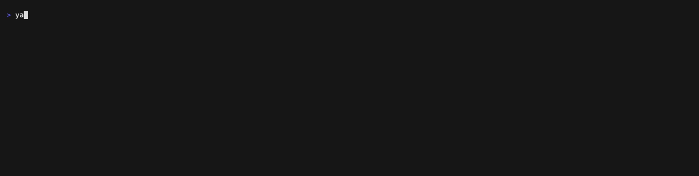
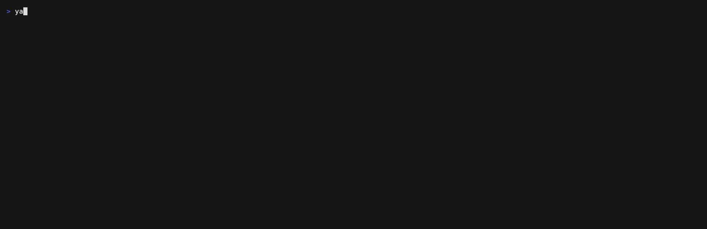

# Yet Another Typosquatting Tool (`yatt`)

`yatt` generates look-alike variants of a domain, resolves them over DNS, and reports which ones are
registered.

Unlike the stateless tools it takes its algorithms from, `yatt` remembers: scan history, cross-scan
diffs, and persistent triage state are the point. Re-scanning a seed tells you what *changed*, and a
verdict you record once is never asked of you again.



## Features

- A permutation technique for every squatting mechanism — typos, keyboard slips, homoglyphs,
  bitsquatting, dot insertion, TLD swaps ([docs/techniques.md](docs/techniques.md) has the full list).
- Registration read from the NS rcode at the registrable domain, so parked, MX-only and
  delegation-only registrations are not missed.
- Per-zone wildcard (catch-all) detection, including registries that never answer NXDOMAIN.
- Concurrent resolution under a QPS ceiling.
- Scan history with cross-scan diff: `new`/`changed`/`unchanged`/`gone`.
- Persistent triage verdicts that survive every future scan.
- State in SQLite — a local file by default, or kept in S3 and shared across machines.
- Scan profiles, a config file, table/JSON/NDJSON output, and AbuseIPDB/Shodan enrichment links.

## Quickstart

```sh
devbox shell          # go, goose, golangci-lint, sqlite, gotestsum
go run . scan example.com
```

Or build a binary:

```sh
go build -o yatt .
./yatt scan example.com
```

## Usage

```text
yatt scan <domain>                  permute, resolve, record, and report
yatt history <domain>               list the recorded scans of a seed
yatt diff <domain>                  compare the last two scans, without resolving
yatt triage <domain> <candidate>    record a verdict on a candidate
yatt triage list <domain>           list the verdicts recorded for a seed
yatt state push|pull|unlock         manage a database kept in S3

Main global flags:
  -o, --output string     output format: table|json|ndjson (default "table")
      --db string         scan database path, or s3://bucket/key to keep it in S3
      --resolver string   upstream DNS resolver as host[:port] (default: the system resolver)
      --qps float         cap DNS queries per second across all workers (0 for unlimited)

Main scan flags:
      --profile string          scan profile: quick|full, or one defined in --config
      --technique strings       techniques to run (default: all)
      --show-unregistered       also report candidates nobody has registered
      --status strings          report only candidates with these triage statuses
      --exclude-status strings  report every candidate except those with these statuses
```

The full command and flag reference is in [docs/cli.md](docs/cli.md).

## Examples

```sh
yatt scan example.com
yatt scan example.com --show-unregistered
yatt scan example.com --technique omission,homoglyph --limit 50
yatt scan example.com --output json | jq '.[] | select(.has_mx)'
yatt scan example.com --resolver 1.1.1.1 --timeout 5s
yatt scan example.com --profile full
```

A verdict recorded once filters every future scan:



## Documentation

| Doc | Covers |
| --- | --- |
| [docs/cli.md](docs/cli.md) | every command and flag, output streams, IDN/punycode handling |
| [docs/techniques.md](docs/techniques.md) | the ten permutation techniques and what each one models |
| [docs/registration.md](docs/registration.md) | how "registered" is decided; zones that never say NXDOMAIN |
| [docs/reporting.md](docs/reporting.md) | report ordering, the seed row, enrichment links |
| [docs/state.md](docs/state.md) | scan history, diff, triage verdicts, and remote state in S3 |
| [docs/configuration.md](docs/configuration.md) | scan profiles and the config file |
| [docs/development.md](docs/development.md) | dev commands, package layout, regenerating the demo gifs |

## Development

See [docs/development.md](docs/development.md): the devbox scripts (`build`, `test`, `lint`), the
package layout, and how the demo gifs regenerate.

## Credits

The permutation algorithms are reimplemented in Go with reference to
[dnstwist](https://github.com/elceef/dnstwist) (Apache-2.0) and
[ail-typo-squatting](https://github.com/typosquatter/ail-typo-squatting) (BSD-2-Clause).

The homoglyph tables are derived from the Unicode Consortium's
[`confusables.txt`](https://www.unicode.org/Public/security/latest/confusables.txt), and the full TLD
list from the [IANA Root Zone Database](https://data.iana.org/TLD/tlds-alpha-by-domain.txt).
`pkg/engine/data/PROVENANCE.md` records the source behind every table, and which of them regenerate.
